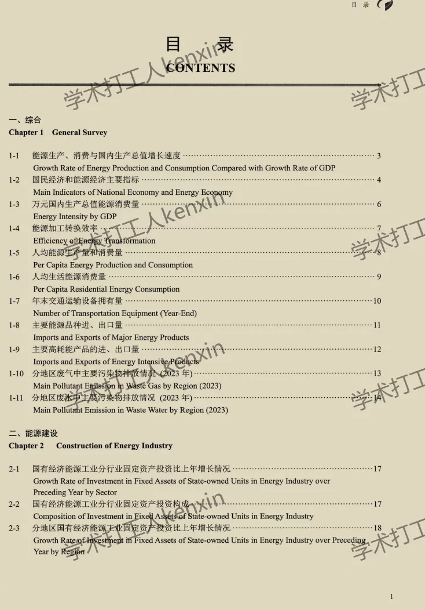
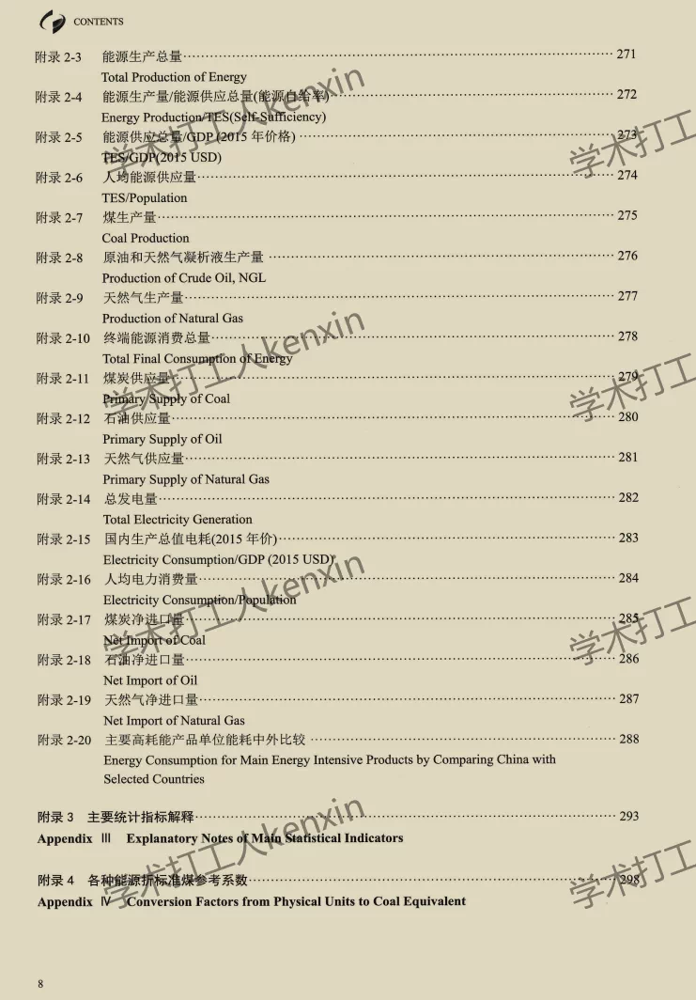
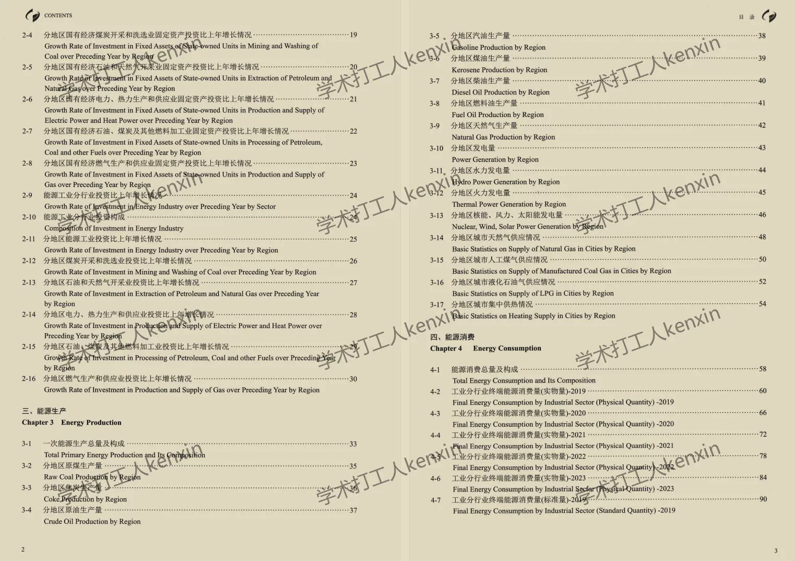
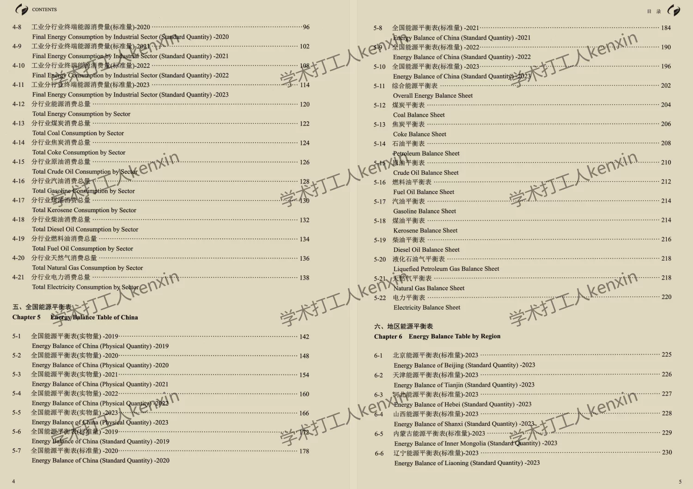
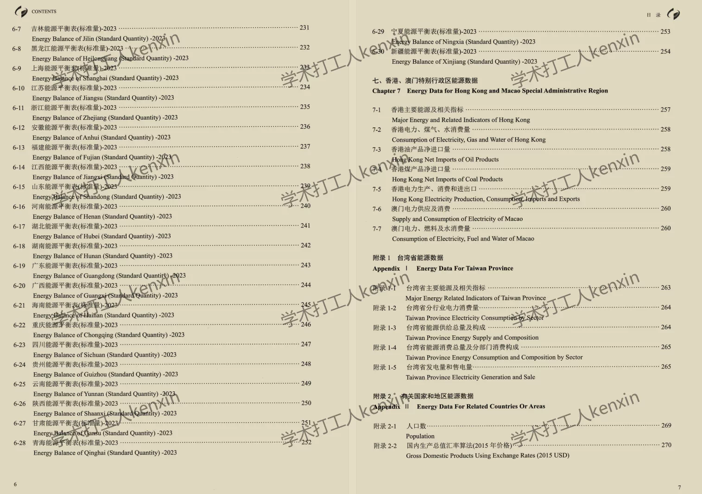
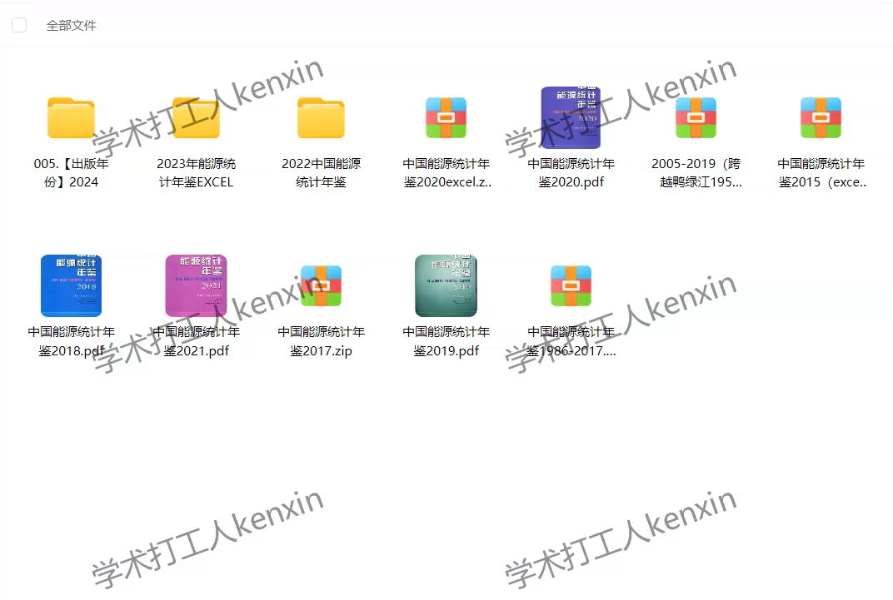

## Body

Excel, PDF "China Energy Statistical Yearbook" 1986-2024

No 1990 included.

I. Data Introduction
Data Name: Energy Statistical Yearbook 1986-2024
Data Year: 1986-2024
Sample Size: 38 years of original yearbooks
Data Format: PDF files, Excel format (Only 1998-2024 years available in Excel)

II. Indicator Explanation
The Energy Statistical Yearbook typically includes detailed data on energy production, consumption, investment, and other aspects across the country and various provinces, autonomous regions, and municipalities directly under the Central Government. It also includes key energy indicators such as energy output, consumption, imports and exports, investment, efficiency, environmental impacts, etc.
The content is extensive; please refer to the image directory for details. Previewing is not supported, and returns after shipment are not accepted without reason. Please consider your purchase carefully before placing an order!

III. Data Files
Energy Statistical Yearbook 1986-2024 in PDF and Excel formats (Excel only available from 1998-2024)

## Images

item_1070193506730

Here is a pay link on Stripe ( https://buy.stripe.com/3cs8yP7sY87d0vu9AB ). Please contact me lonlonago@foxmail.com after funding $89, and I will send you a complete data files , thank you!

